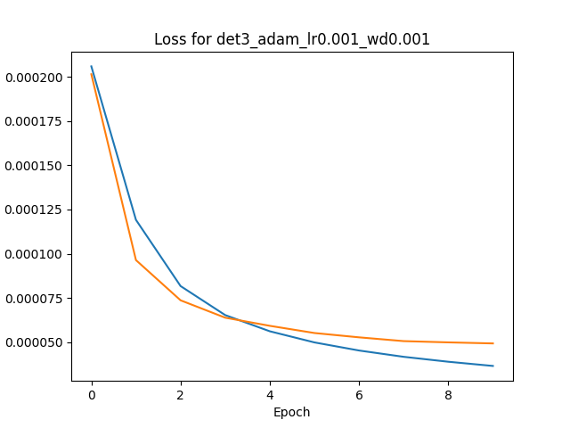
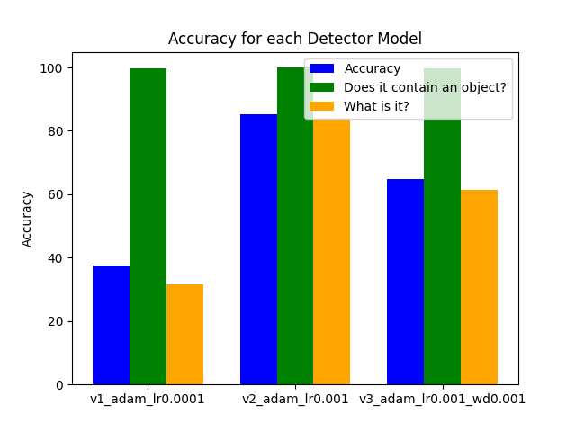

# UIB INF265 Project 1
Group: **Project 1 18**  
Students:
- **Mats Omland Dyrøy (mdy020)**
- **Linus Krystad Raaen (zec018)**

# Distribution of labor

We mostly met at `Høyteknologisenteret` and performed our work there.  
Mats did most of the programming, Linus provided statistical insights and competence in deep learning.

# Design
We tried preprocessing the data with erosion and dilation to get rid of some of the noise, but the results werent great so we decided against using it for the final project. We also noticed some of the labels didnt match up with what we assumed to humbers to be and some of the boxes werent on top of where we would place the number so that could be a source of error when it comes to accuracy, however we didnt find a good fix against this so for now it will just be left as is. 

Since training the models takes a long time we made a function that checks whether a model is trained already and if it is loads it. 

# Models

We trained three models for each task (localization and detection).  
The approach to the problems were quite different and will be detailed in their respective section [Object localization](#object-localization) and [Object detection](#object-detection).

# Object localization

## Label distribution
Before learning the dataset, we looked for any obvious biases in the data.  
We quicly concluded that the label distribution was uniform.

  
(_The other datasets looked similar, but we choose not to include the graphs in the report. They can be found at the bottom of the jupiter file._)

## Samples
Then we took a look at some samples from the dataset. (_These are from the test set._)

The images are very noisy and the digits can be quite small in comparison to the "canvas".  
The noise seems to be a form of gradient noise.

## Network
With a feel for the dataset, we created a network architecture:

## Training

We then trained three models based on this architecture: `v1_adam_lr0.0001`, `v2_adam_lr0.001` and `v3_adam_lr0.001wd0.001`.  

### v1_adam_lr0.0001
`v1_adam_lr0.0001` was trained using the `Adam` optimizer and has a learning rate of `0.0001`.

### v2_adam_lr0.001
`v2_adam_lr0.001` was trained using the `Adam` optimizer and has a learning rate of `0.001`.  
As we will see shortly, this model performed the best. 

### v3_adam_lr0.001wd0.001
`v3_adam_lr0.001wd0.001` was also trained using the `Adam` optimizer and has a learning rate of `0.001` and a weight decay of `0.001`.  

As the loss curves clearly shows, we could certanly benefit from more epochs during training, but we had limited computer resources.

## Validation
The models were all validated using the validation dataset.

This graph shows that all the models became very good at predicting wether or not an image contained a digit. (All reaching over 98% in this measurement)

## Picking a winner
As mentioned earlier, `v2_adam_lr0.001`, performed the best.  
We tracked a number of metrics during evaluation like `IoU`, `prediction accuracy`, `classifier accuracy` and `confidence accuracy`.  
`prediction accuracy` is a combination of `classifier accuract` and the ability to detect empty images.  
Ultimately, we used a combination of `IoU` and `prediction accuracy` to determine a `score`.  
This `score` identifies the models comperative performance.  

In this category, and all other categories for that matter, `v2_adam_lr0.001` performed the best.

Here are the samples form earlier overlaid with predictions from `v2_adam_lr0.001`:  

The winner was then tested on the test dataset:

# Object detection

## Samples
Like in object localization, we took a peek at some data before starting. (_These are from the test set._)

These images are also very noisy and the digits can be quite small in comparison to the "canvas".  

## Network
The network follows a very similar structure to the object localization network, except the last fully connected layers are replaced with more convolutions.  
We attempted to model a simplified YOLO network.

## Training

We then trained three models based on this architecture: `det1_adam_lr0.0001`, `det2_adam_lr0.001` and `det3_adam_lr0.001wd0.001`.  

### det1_adam_lr0.0001
`det1_adam_lr0.0001` was trained using the `Adam` optimizer and has a learning rate of `0.0001`.

### det2_adam_lr0.001
`det2_adam_lr0.001` was trained using the `Adam` optimizer and has a learning rate of `0.001`.  
As we will see shortly, this model performed the best.  
Sadly, there was a mixup when training this model, and the loss graph was added to the one for the next model.  
We did not want to wait for the model to train again, so to clarify:
This is the blue line og the graph below, an `det3_adam_lr0.001wd0.001` is the orange line.

### det3_adam_lr0.001wd0.001
`det3_adam_lr0.001wd0.001` was also trained using the `Adam` optimizer and has a learning rate of `0.001` and a weight decay of `0.001`.  

As the loss curves clearly shows, we could certanly benefit from more epochs during training, but we had limited computer resources.

## Validation
The models were all validated using the validation dataset.

This graph shows that all the models became very good at predicting wether or not an image contained a digit. (All reaching over 96% in this measurement)

## Picking a winner
As mentioned earlier, `det2_adam_lr0.001`, performed the best.  
We tracked the same metrics as for object localization: `IoU`, `prediction accuracy`, `classifier accuracy` and `confidence accuracy`. 
We also here used a combination of `IoU` and `prediction accuracy` to determine a `score`.  
This `score` identifies the models comperative performance.  

The main difference is that the metrics are averaged over all the predictions and labels for an image.

`det2_adam_lr0.001` performed the best by all measurements.

Here are the samples form earlier overlaid with predictions from `det2_adam_lr0.001`:  

The winner was then tested on the test dataset:
